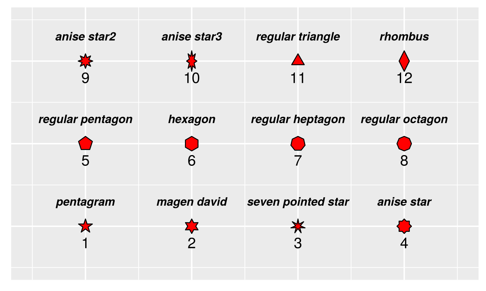
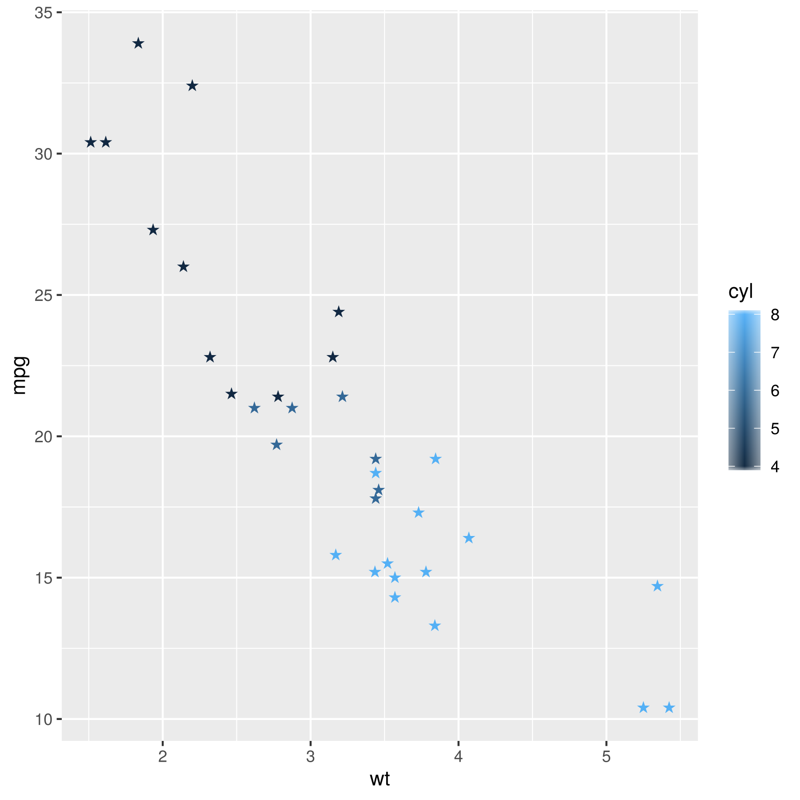
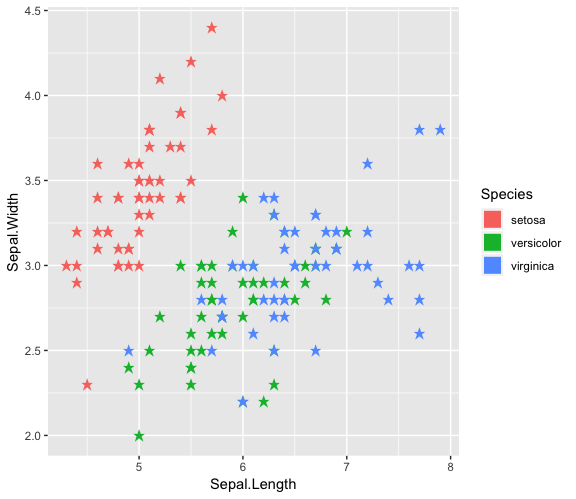
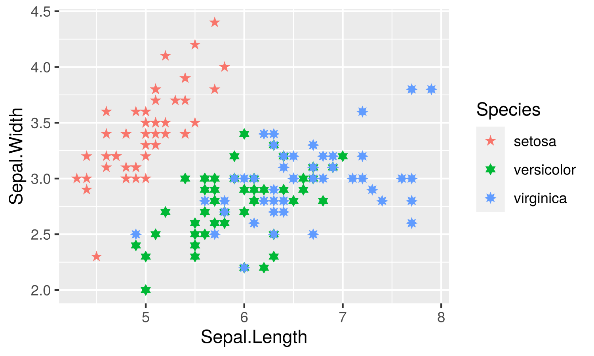

<!-- README.md is generated from README.Rmd. Please edit that file -->

# ggstar: star layer for ggplot2

```{r, echo=FALSE, results="hide", message=FALSE}
library(badger)
```


[](https://cran.r-project.org/package=ggstar)
<!-- r badge_devel("xiangpin/ggstar", "green") -->
[](https://cran.r-project.org/package=ggstar)
[](https://cranlogs.r-pkg.org/downloads/total/last-month/ggstar)
[](https://cranlogs.r-pkg.org/downloads/total/last-week/ggstar)

```{r, comment="", echo=FALSE, results='asis'}
cat(packageDescription('ggstar')$Description)
```

# :writing_hand: Author

[Shuangbin Xu](https://github.com/xiangpin)

School of Basic Medical Sciences, Southern Medical University

# :arrow_double_down: Installation

Get the released version from `CRAN`:

```r
install.packages("ggstar")
```

Or the development version from `github`:

```r
if (!requireNamespace("devtools", quietly=TRUE))
    install.packages("devtools")
devtools::install_github("xiangpin/ggstar")
```

# :beginner: Usage

Total starshapes:



```r
library(ggplot2)
library(ggstar)
p <- ggplot(data=mtcars, 
            mapping=aes(x=wt, 
                        y=mpg, 
                        fill=cyl)) + 
     geom_star()
p
```



```r
p2 <- ggplot(data=iris, 
             mapping=aes(x=Sepal.Length, 
                         y=Sepal.Width, 
                         fill=Species)) +
     geom_star()
p2
```



```r
p3 <- ggplot(data=iris,
             mapping=aes(x=Sepal.Length,
                         y=Sepal.Width,
                         fill=Species,
                         starshape=Species)) +
      geom_star() + scale_starshape_manual(values=c(1, 2, 9))
p3
```



# :book: Vignette

For more details, please refer to the [online vignette](https://cran.r-project.org/web/packages/ggstar/vignettes/ggstar.html)

If you have installed it, you can also view the vignette on local.

```r
browseVignettes("ggstar")
```

# :sparkling_heart: Contributing

We welcome any contributions! By participating in this project you agree to abide
by the terms outlined in the [Contributor Code of Conduct](CONDUCT.md).
